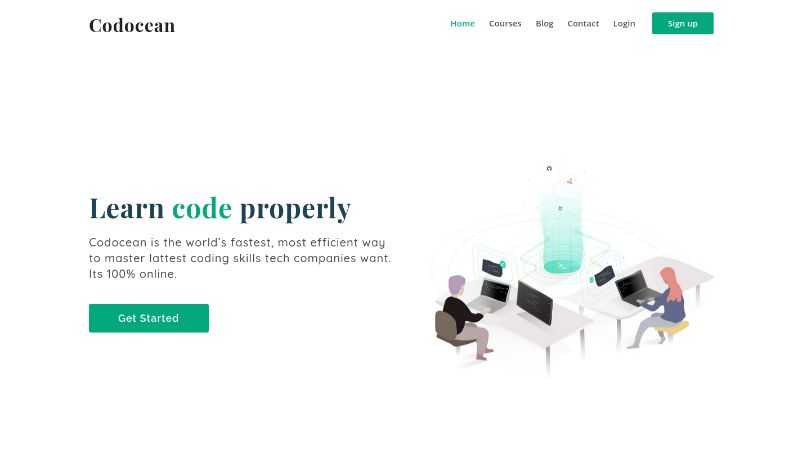
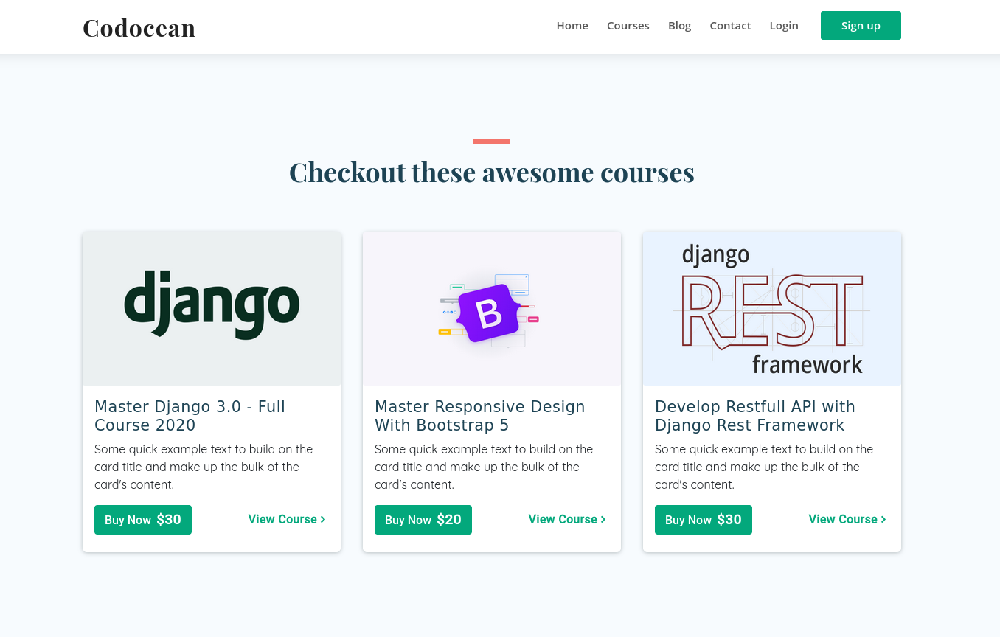

# A Online Learning website built with Django.

This is a project built using Django, embed-video, django-braces and memcache

## Demo:



## Installation:
**1.Clone Repo**
```sh
git clone https://github.com/shyam999/codeteacher.git
```
**2.Setup Virtualenv & Install Requirements**
```sh
pipenv install -r requirements.txt
pipenv shell
```
**3.Migrate Database**
```sh
python manage.py makemigrations
python manage.py migrate
```
**4.Run Server**
```sh
python manage.py runserver
```


## Where to find Me
visit My [Website](shyam999.github.io)
